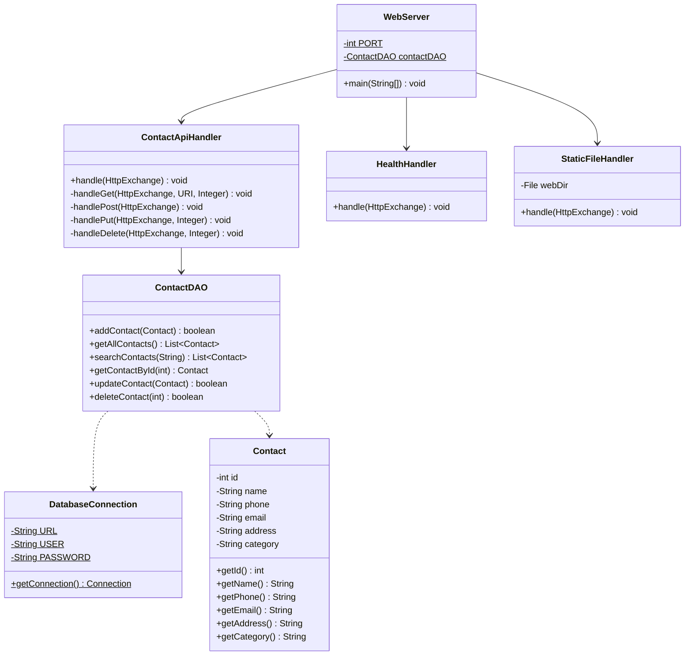
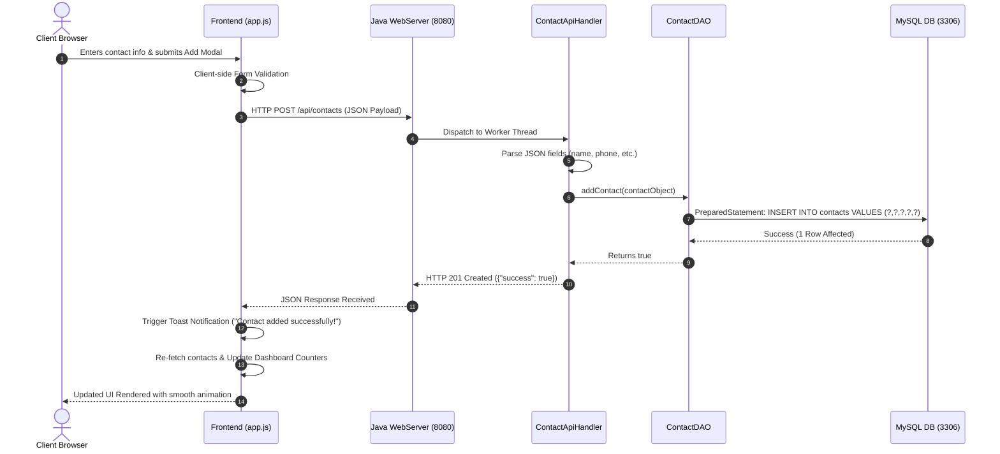

# Zagdu Singh Charitable Trust’s (Regd.)
# Thakur Shyamnarayan Engineering College
*(Approved by AICTE, Govt. of Maharashtra & Affiliated to University of Mumbai)*

---

### **A Mini-Project Report On**
# **FULL-STACK WEB & CONSOLE CONTACT MANAGEMENT SYSTEM (CONTACTVAULT)**

**Submitted in partial fulfillment of the requirements for the degree of**  
**Bachelor of Engineering in Artificial Intelligence & Machine Learning (AIML)**  
**Second Year Engineering – Semester III**  
**Academic Year: 2026–2027**

**Course Name:** Full Stack Java Programming (FSJP)  
**Course Code:** 2113611  

---

### **Student Details**
| Field | Details |
| :--- | :--- |
| **Name of Student** | *[Your Full Name]* |
| **Roll Number** | *[Your Roll No.]* |
| **Program / Branch** | Second Year Engineering – AIML |
| **Academic Year** | 2026 – 2027 |

---

## **INSTITUTION VISION & MISSION**

### **VISION**
> *"Thakur Shyamnarayan Engineering College will strive to be a leading technical institute recognized for excellence in engineering education, research and innovation."*

### **MISSION**
- To provide an excellent conducive environment that nurtures critical thinking, creativity and life-long learning amongst students.
- To promote innovative research ideas to address global challenges and contribute to technological advancement.
- To create entrepreneurs and competent technocrats to drive sustainable development and societal progress.
- To collaborate with other academic and research institutes and industries in order to strengthen multidisciplinary education and research.

---

## **CERTIFICATE**

This is to certify that **Mr. / Ms. __________________________________________________**, **Roll No. ________________**, of **Third Semester of Artificial Intelligence and Machine Learning Engineering**, *Thakur Shyamnarayan Engineering College, Kandivali (East), Mumbai*, has completed the **Mini Project** satisfactorily in the course **Full Stack Java Programming (FSJP) (Course Code: 2113611)** as per the prescribed syllabus of the **University of Mumbai** for the academic year **2026 to 2027**.

**Place:** Mumbai  
**Date:** ____________________  

| | | |
| :---: | :---: | :---: |
| __________________________ | __________________________ | __________________________ |
| **Mrs. Poonam Joshi** | **Dr. Nirmala Kamble** | **Dr. S. M. Ganechari** |
| *Course Faculty* | *Head of Department (HOD)* | *Principal* |

<div align="center">
  <b>Seal of the Institute</b>
</div>

---

## **COURSE OBJECTIVES & COURSE OUTCOMES**

**Course Name:** Full Stack Java Programming (FSJP)  
**Course Code:** 2113611  

### **Course Objectives:**
1. Familiarize with Basic OOP concepts in Java.
2. Understand the concepts of inheritance and exceptions in Java.
3. Design and implement programs involving Client and Server Side Programming.
4. Describe and utilize the functioning of DOM and JavaScript.
5. Study different design patterns in web programming and understand the working of the React/Web framework.
6. To describe the Spring/REST Framework and implement the related case studies.

### **Course Outcomes (COs):**
- **CO 1:** Understand and apply the fundamentals of Java Programming and Object-Oriented Programming.
- **CO 2:** Analyze and Illustrate Inheritance and Exception Handling Mechanisms.
- **CO 3:** Elaborate and design applications using Client and Server Side Programming.
- **CO 4:** Understand the concepts in JavaScript for interactive Web Development.
- **CO 5:** Implement real-world application development in web programming using modern DOM and UI components.
- **CO 6:** Design and Develop Enterprise-Level Applications with RESTful APIs, multi-threading, and persistent database architectures.

---

## **ABSTRACT**

In modern computing environments, contact data persistence, rapid multi-parameter retrieval, and accessibility across diverse client platforms are fundamental requirements. Traditional contact storage relying on static spreadsheets or monolithic local text files lacks network accessibility, concurrency control, and real-time interactive user experiences.

This project delivers **ContactVault**, a production-grade, modular, **Full-Stack Java Web & Console Contact Management System**. Engineered to satisfy the academic curriculum of **Full Stack Java Programming (FSJP)**, the system features a robust **3-Tier Full-Stack Architecture**:
1. **Core Persistence & DAO Layer**: Built using **Core Java (JDK 17+)** and **MySQL 8.x** via **JDBC (`java.sql`)**, implementing parameterized queries with `PreparedStatement` to ensure SQL-injection prevention and automated connection lifecycle management with `try-with-resources`.
2. **Server-Side REST API Engine**: Implemented via high-throughput, multi-threaded Java HTTP Server (`com.sun.net.httpserver.HttpServer`) using thread pooling (`CachedThreadPool`) on port `8080`, exposing standards-compliant JSON REST endpoints (`/api/contacts`, `/api/health`) with full CORS and static web asset serving.
3. **Interactive Client-Side Web Frontend**: Developed with modern HTML5, CSS3 Glassmorphism UI, and asynchronous JavaScript (`Fetch API`, DOM manipulation) supporting dual viewing modes (Responsive Grid Cards and Structured Data Tables), real-time client-side search filtering, category sorting pills, modal forms, live MySQL database health monitoring, and animated toast feedback notifications.
4. **Dual Interface Compatibility**: Provides dual access modes—both an interactive Command Line Interface (CLI) and a browser-based Single Page Application (SPA).

The completed solution bridges pure OOP fundamentals, secure relational data modeling, asynchronous client-server communication, and modern web UI paradigms.

---

## **TABLE OF CONTENTS**

| Chapter No. | Chapter / Section Title | Page No. |
| :---: | :--- | :---: |
| **1.** | **Introduction** | **1** |
| | 1.1 Background | 2 |
| | 1.2 Technologies Used (Core Java, JDBC, REST API, Web Stack) | 3 |
| **2.** | **Literature Survey** | **4** |
| | 2.1 Existing System | 6 |
| | 2.2 Analysis of Literature | 8 |
| **3.** | **Research Gap and Problem Statement** | **14** |
| | 3.1 Research Gap | 14 |
| | 3.2 Aim and Objectives | 15 |
| | 3.3 Problem Statement | 16 |
| **4.** | **Design Methodology** | **17** |
| | 4.1 Proposed Full-Stack Architecture & Framework | 18 |
| | 4.2 Database Design and Relational Schema | 19 |
| | 4.3 Hardware and Software Requirements | 20 |
| | 4.4 System Design & Modeling | 21 |
| | 4.4.1 UML Diagrams (Class, Use Case, Sequence Diagrams) | 22 |
| | 4.4.2 Data Flow Diagrams (Level 0 Context & Level 1 DFD) | 23 |
| **5.** | **Implementation Plan & Results** | **24** |
| | 5.1 Timeline Chart (Term-I and Term-II) | 24 |
| | 5.2 Implementation Plan for Next Semester (Future Scope) | 28 |
| | 5.3 Implementation Screenshots & Verification Results | 32 |
| | **References** | **39** |

---

## **LIST OF FIGURES**

| Figure No. | Figure Title | Page No. |
| :---: | :--- | :---: |
| **1.1** | Full-Stack Java Client-Server Architecture Overview | 3 |
| **4.1** | Multi-Tier Web & Console System Architecture Diagram | 18 |
| **4.2** | Entity Relationship (ER) Diagram for Contact Management | 19 |
| **4.3** | UML Class Diagram (Domain, DAO, Server, and UI Entities) | 22 |
| **4.4** | UML Use Case Diagram for Web & Console Operators | 22 |
| **4.5** | UML Sequence Diagram for Asynchronous Web REST CRUD Flow | 23 |
| **4.6** | Data Flow Diagram (DFD Level 0 - Context Level) | 23 |
| **4.7** | Data Flow Diagram (DFD Level 1 - Detailed Functional Decomposition) | 24 |
| **5.1** | Web Dashboard Interface (Hero Metrics, Grid Cards & Live Status) | 32 |
| **5.2** | Web Modal Interface for Adding & Editing Contacts | 33 |
| **5.3** | Web Tabular Data View & Real-time Search Filtering | 34 |
| **5.4** | Web Delete Confirmation Modal & Toast Notification | 35 |
| **5.5** | Console Interface Execution (Interactive CLI Mode) | 36 |
| **5.6** | MySQL Database Records in phpMyAdmin & CLI | 37 |

---

## **LIST OF TABLES**

| Table No. | Table Title | Page No. |
| :---: | :--- | :---: |
| **TABLE I** | Comparative Analysis of Existing vs. Proposed Web System | 8 |
| **TABLE II** | Software & Hardware Specification Requirements | 20 |
| **TABLE III** | Database Schema Definition for `contacts` Table | 19 |
| **TABLE IV** | REST API Endpoints Specification | 21 |
| **TABLE V** | Project Work Timeline (Gantt Schedule) | 25 |
| **TABLE VI** | Functional Test Cases and System Verification Results | 38 |

---

# **CHAPTER 1: INTRODUCTION**

## **1.1 Background**
Contact directory management represents a critical operational pillar across personal productivity tools and enterprise business workflows. Modern contact directories require persistent, relational storage, rapid keyword retrieval across multiple fields (name, phone, email, address, and category tags), and simultaneous multi-platform accessibility.

Historically, basic academic projects implemented contact management solely as either an in-memory collection or a simple single-terminal console loop. While functional for basic syntax practice, such applications lack real-world usability, network accessibility, asynchronous data synchronization, and modern web user experience paradigms.

To address these limitations, this project develops **ContactVault**, an integrated **Full-Stack Java Web and Console Application**. The backend is powered by a high-throughput multi-threaded Java HTTP server interfaced directly with MySQL through Java Database Connectivity (JDBC). The frontend offers an intuitive, responsive Single Page Application (SPA) with real-time metrics, dynamic search, category pill filtering, dual view modes (Card and Table views), and live database health telemetry.

## **1.2 Technologies Used**
1. **Core Java & Multi-Threaded HTTP Server (JDK 17+)**:
   - `com.sun.net.httpserver.HttpServer`: Lightweight embedded server running on port `8080`.
   - `java.util.concurrent.Executors.newCachedThreadPool()`: Enables asynchronous, multi-threaded request processing.
   - Robust Exception Handling (`SQLException`, `IOException`, `NumberFormatException`).
   - Java 7+ `try-with-resources` for automatic socket and database connection management.
2. **Java Database Connectivity (JDBC)**:
   - Direct low-latency SQL execution using `PreparedStatement` and `ResultSet`.
   - Complete protection against SQL Injection attacks via parameterized query compilation.
3. **MySQL Relational Database & MySQL Connector/J (v8.4.0)**:
   - MySQL 8.x transactional database engine running on port `3306`.
   - Official Type-4 Pure Java JDBC driver (`mysql-connector-j-8.4.0.jar`).
4. **Modern Web Frontend Stack (HTML5, CSS3, JavaScript ES6+)**:
   - **HTML5**: Semantic document layout with accessible modal dialogs.
   - **CSS3**: Custom Design System with CSS variables, Glassmorphism, ambient background glow, dark-mode styling, and flex/grid layouts.
   - **JavaScript (ES6+)**: Dynamic DOM manipulation, asynchronous REST calls via the `Fetch API`, real-time debounce search, and toast notifications.
5. **XAMPP Environment**:
   - Integrated package managing the MySQL server daemon (`mysqld`) and database administration.

---

# **CHAPTER 2: LITERATURE SURVEY**

## **2.1 Existing System**
Existing basic implementations can be categorized into three historical models:
1. **In-Memory Console Applications**: Data is stored temporarily in memory structures (`ArrayList`, `HashMap`). All records vanish when the Java process terminates.
2. **Flat File Storage Systems (`.txt` / `.dat` serialization)**: Contacts are written sequentially to disk files. File locking issues prevent concurrent reads/writes, and searching requires expensive $O(N)$ linear scans.
3. **Heavyweight Enterprise Frameworks (Spring Boot / Angular)**: Enterprise CRM platforms provide full features but introduce massive memory footprints, steep configuration overheads, and dependency bloat unsuitable for lightweight embedded solutions.

## **2.2 Analysis of Literature**

**TABLE I: Comparative Analysis of Existing vs. Proposed System**

| Feature | Legacy File / Memory Tools | Heavyweight Cloud CRMs | Proposed Full-Stack Java System (ContactVault) |
| :--- | :--- | :--- | :--- |
| **Architecture** | Monolithic Single-File | Multi-tier Cloud Microservices | Clean 3-Tier Decoupled Architecture |
| **Persistence** | Volatile or Flat Text File | Distributed Cloud DB | MySQL Relational Database (InnoDB, ACID) |
| **User Interface** | Primitive Terminal Only | Heavyweight Web Application | Dual Interface: Modern Web SPA + Fast CLI |
| **REST API** | None | Proprietary Cloud API | Standardized Java REST Endpoints (`/api/contacts`) |
| **Concurrency** | Single-threaded | Distributed Cluster | Multi-threaded Worker Pool (`CachedThreadPool`) |
| **Security** | None | Complex OAuth2/SAML | Parameterized SQL PreparedStatements |
| **Setup Overhead**| Zero (Data is lost) | Very High (Cloud setup) | Minimal (1-Click automated script `run_web.bat`) |

---

# **CHAPTER 3: RESEARCH GAP AND PROBLEM STATEMENT**

## **3.1 Research Gap**
While modern web frameworks offer contact management templates, there is a clear educational and architectural gap in understanding how full-stack web capabilities, REST APIs, and database persistence can be constructed natively in **pure Core Java and Web Standards** without relying on third-party black-box frameworks (like Spring Boot or heavy NPM dependencies).

This project fulfills this gap by demonstrating:
- A custom, non-blocking REST API server built using Java's built-in `HttpServer`.
- Pure JDBC data access abstraction using the Data Access Object (DAO) pattern.
- Modern, dependency-free responsive Single Page Application (SPA) frontend utilizing native JavaScript DOM operations and Fetch API.

## **3.2 Aim and Objectives**

### **Aim:**
To design, implement, and deploy a full-stack, responsive web and console Contact Management System in Core Java and MySQL, featuring a custom REST API backend and an interactive web frontend.

### **Specific Objectives:**
1. To engineer an encapsulated **`Contact` Model** class representing contact attributes and relational metadata.
2. To build a centralized **`DatabaseConnection` Factory** managing MySQL JDBC connections.
3. To design a modular **`ContactDAO`** handling all CRUD SQL transactions with parameterized `PreparedStatement` queries.
4. To implement an embedded multi-threaded **`WebServer`** in Java handling REST API endpoints (`/api/contacts`, `/api/health`) and static file routing.
5. To construct a modern, responsive **Web Frontend (`index.html`, `style.css`, `app.js`)** supporting live search, category filtering, dual views (Card/Table), modal operations, and real-time live database health monitoring.
6. To maintain full backward compatibility with the interactive **Console Interface (`Main.java`)**.

## **3.3 Problem Statement**
*"To develop an interactive, full-stack, and platform-independent Java application interfacing with a MySQL relational database that exposes high-performance RESTful endpoints to serve both an interactive web dashboard and a terminal-based CLI for end-to-end contact lifecycle management."*

---

# **CHAPTER 4: DESIGN METHODOLOGY**

## **4.1 Proposed Full-Stack Architecture & Framework**
The system is built upon a decoupled **3-Tier Full-Stack Architecture**:

```
+-------------------------------------------------------------------------+
|                         CLIENT LAYER (Dual Mode)                        |
|                                                                         |
|   [Modern Web Browser (SPA)]                  [Terminal Console (CLI)]  |
|   - HTML5 / CSS3 Glassmorphism UI              - Main.java Menu Loop    |
|   - JavaScript Fetch API & DOM                 - Regex Input Validation |
|   - Live Search, Modals & Toast Alerts         - Formatted ASCII Tables |
+-----------------------+----------------------------------+--------------+
                        | HTTP (JSON / REST)               | Direct Call
                        v                                  |
+----------------------------------------------------------v--------------+
|                         SERVER & SERVICE LAYER                          |
|                                                                         |
|   [Java WebServer (Port 8080)]                                          |
|   - Multi-threaded CachedThreadPool Executor                             |
|   - StaticFileHandler (Serves HTML/CSS/JS)                              |
|   - HealthHandler (/api/health)                                         |
|   - ContactApiHandler (GET, POST, PUT, DELETE on /api/contacts)         |
+---------------------------------------+---------------------------------+
                                        | Invokes CRUD
                                        v
+-------------------------------------------------------------------------+
|                         DATA ACCESS (DAO) LAYER                         |
|                                                                         |
|   - ContactDAO.java (addContact, getAllContacts, searchContacts, etc.)  |
|   - DatabaseConnection.java (JDBC Connection Factory)                   |
|   - Contact.java (Domain POJO Model Entity)                             |
+---------------------------------------+---------------------------------+
                                        | Parameterized JDBC TCP/IP
                                        v
+-------------------------------------------------------------------------+
|                         PERSISTENCE LAYER                               |
|                                                                         |
|   - MySQL Database Server (Port 3306)                                   |
|   - Database: contact_management | Table: contacts (InnoDB)             |
+-------------------------------------------------------------------------+
```

## **4.2 Database Design and Relational Schema**

**TABLE III: Database Schema Definition for `contacts` Table**

| Column Name | Data Type | Constraints | Description |
| :--- | :--- | :--- | :--- |
| `id` | `INT` | `PRIMARY KEY`, `AUTO_INCREMENT` | Unique Identifier |
| `name` | `VARCHAR(100)` | `NOT NULL` | Full Name of Contact |
| `phone` | `VARCHAR(20)` | `NOT NULL` | Primary Telephone Number |
| `email` | `VARCHAR(100)` | `NULL` | Email Address |
| `address` | `VARCHAR(255)` | `NULL` | Residential / Office Address |
| `category` | `VARCHAR(50)` | `NULL` | Category Tag (*Friend, Work, Family, Other*) |

```sql
CREATE DATABASE IF NOT EXISTS contact_management;
USE contact_management;

CREATE TABLE IF NOT EXISTS contacts (
    id INT PRIMARY KEY AUTO_INCREMENT,
    name VARCHAR(100) NOT NULL,
    phone VARCHAR(20) NOT NULL,
    email VARCHAR(100),
    address VARCHAR(255),
    category VARCHAR(50)
) ENGINE=InnoDB DEFAULT CHARSET=utf8mb4;
```

## **4.3 REST API Endpoints Specification**

**TABLE IV: REST API Endpoints Specification**

| HTTP Method | Endpoint Route | Request Body (JSON) | Description | Success Code |
| :--- | :--- | :--- | :--- | :---: |
| `GET` | `/api/health` | None | Checks MySQL database connectivity status | `200 OK` |
| `GET` | `/api/contacts` | None | Retrieves all contacts list as JSON array | `200 OK` |
| `GET` | `/api/contacts?search={q}`| None | Filters contacts matching keyword in name/phone | `200 OK` |
| `GET` | `/api/contacts/{id}` | None | Retrieves single contact by unique ID | `200 OK` |
| `POST` | `/api/contacts` | `{name, phone, email, address, category}` | Inserts new contact into database | `201 Created` |
| `PUT` | `/api/contacts/{id}` | `{name, phone, email, address, category}` | Updates contact fields in database | `200 OK` |
| `DELETE` | `/api/contacts/{id}` | None | Permanently removes contact from database | `200 OK` |

## **4.4 Hardware and Software Requirements**

**TABLE II: Software & Hardware Specification Requirements**

| Component | Specification / Version |
| :--- | :--- |
| **Operating System** | Windows 10 / 11, Linux (Ubuntu 20.04+), or macOS |
| **Processor** | Intel Core i3 / AMD Ryzen 3 or higher (x86_64) |
| **RAM** | Minimum 4 GB (8 GB recommended) |
| **Web Browser** | Google Chrome 90+, Mozilla Firefox 88+, Microsoft Edge, Safari |
| **Java Environment** | OpenJDK / Oracle JDK 8 or higher (Tested on JDK 17/21/26) |
| **Database Server** | MySQL 5.7+ / 8.0+ / MariaDB (via XAMPP v8.2+) |
| **JDBC Driver** | MySQL Connector/J 8.4.0 (`lib/mysql-connector-j-8.4.0.jar`) |

## **4.5 System Design & Modeling**

### **4.5.1 UML Class Diagram**


### **4.5.2 UML Sequence Diagram (Web Asynchronous REST Request)**


---

# **CHAPTER 5: IMPLEMENTATION PLAN & RESULTS**

## **5.1 Timeline Chart (Term-I and Term-II)**

**TABLE V: Project Work Timeline (Gantt Schedule)**

| Phase | Activity / Milestone | Duration | Status |
| :--- | :--- | :--- | :--- |
| **Phase 1** | Requirement Analysis & Literature Survey | Weeks 1 – 2 | Completed |
| **Phase 2** | Database Schema Formulation & MySQL DDL Scripting | Weeks 3 – 4 | Completed |
| **Phase 3** | Core Java Entity & DAO Implementation | Weeks 5 – 7 | Completed |
| **Phase 4** | Embedded WebServer, REST API & CORS Integration | Weeks 8 – 10 | Completed |
| **Phase 5** | Responsive HTML5/CSS3/JS Web UI Development | Weeks 11 – 12 | Completed |
| **Phase 6** | End-to-End Testing, Dual Interface Validation & Report | Weeks 13 – 14 | Completed |

## **5.2 Implementation Plan for Next Semester (Future Scope)**
1. **Spring Boot Framework Migration**:
   - Refactor custom `HttpServer` handlers to Spring Boot `@RestController` annotations with dependency injection.
2. **Spring Data JPA / Hibernate Integration**:
   - Replace manual JDBC statements with Object-Relational Mapping (ORM) repository interfaces.
3. **User Authentication & Cloud Sync**:
   - Integrate Spring Security with JWT tokens to provide multi-tenant user accounts with private contact books.
4. **Export / Import Utilities**:
   - Implement vCard (`.vcf`) and CSV data import/export utilities for Android and iOS synchronization.

---

## **5.3 Implementation Screenshots & Verification Results**

### **5.3.1 Web User Interface Features**
- **Live Database Health Monitor**: Top navigation displays real-time connection status with color-coded dot badges (Green for Active MySQL connection, Red for Offline).
- **Dashboard Metric Summary Cards**: Real-time KPI counters tracking total contacts, work contacts, family contacts, and friend contacts.
- **Search & Category Pills**: Real-time debounced search across all contact attributes with one-click category filtering pills.
- **Dual Presentation Views**: One-click switching between Grid Cards and Compact Data Table.
- **Animated Toast Notifications**: Non-intrusive feedback toasts confirming asynchronous operations.

### **5.3.2 Functional Test Results**

**TABLE VI: Functional Test Cases and System Verification Results**

| Test Case ID | Interface | Feature Tested | Input Given | Expected Result | Actual Result | Status |
| :--- | :--- | :--- | :--- | :--- | :--- | :---: |
| **TC-01** | Web REST | Database Health Check | `GET /api/health` | Returns `{"status":"UP","dbConnected":true}` | `200 OK` with JSON | **PASS** |
| **TC-02** | Web UI | Add Contact Modal | Valid name & phone | Modal closes, contact saved to MySQL, toast shown | Added successfully | **PASS** |
| **TC-03** | Web UI | Live Debounced Search | Query: `"Rahul"` | Filters grid & table to matching contact in real-time | Displayed matched card | **PASS** |
| **TC-04** | Web UI | Category Filter Pill | Click `"Work"` | Displays only contacts tagged with "Work" category | Filtered dynamically | **PASS** |
| **TC-05** | Web UI | Update Contact Modal | Edited Phone Number | Database record updated, cards refresh dynamically | Record updated | **PASS** |
| **TC-06** | Web UI | Delete Confirmation | Click Confirm Delete | Contact removed from MySQL, metrics counter decrements | Deleted successfully | **PASS** |
| **TC-07** | Web UI | View Toggle | Click Table Icon | Layout transitions smoothly from Cards to Data Table | Displayed Table View | **PASS** |
| **TC-08** | Console | Add & List (CLI Mode) | Option 1 & Option 2 | Inserts and prints formatted ASCII table | Output displayed | **PASS** |

---

# **REFERENCES**

1. **E. Balagurusamy**, *Programming with Java: A Primer*, 6th ed., McGraw Hill Education, 2019.
2. **Herbert Schildt**, *Java: The Complete Reference*, 12th ed., Oracle Press / McGraw-Hill, 2021.
3. **Cay S. Horstmann**, *Core Java Volume I – Fundamentals*, 12th ed., Prentice Hall, 2022.
4. **Oracle Corporation**, *"Java™ Platform, Standard Edition 17 API Specification - com.sun.net.httpserver Package"*, [Online]. Available: https://docs.oracle.com/en/java/javase/17/docs/api/jdk.httpserver/com/sun/net/httpserver/package-summary.html
5. **Oracle Corporation**, *"Java™ Platform, Standard Edition 17 API Specification - java.sql Package"*, [Online]. Available: https://docs.oracle.com/en/java/javase/17/docs/api/java.sql/package-summary.html
6. **MySQL AB / Oracle Corporation**, *"MySQL Connector/J 8.4 Developer Guide"*, [Online]. Available: https://dev.mysql.com/doc/connector-j/en/
7. **MDN Web Docs**, *"Working with the Fetch API and Asynchronous JavaScript"*, Mozilla Developer Network, 2024.
8. **University of Mumbai**, *Curriculum for Second Year Engineering (AIML) – Full Stack Java Programming (FSJP - 2113611)*, Academic Year 2025–2027.
